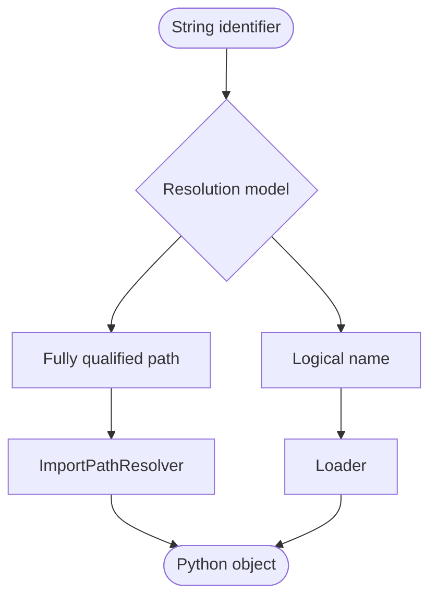

Modern Python applications are increasingly configurable and extensible.

Instead of hardcoding implementations, applications often select objects dynamically from configuration files, databases, APIs, or user-defined extensions. Typical examples include storage backends, authentication providers, serializers, handlers, or plugins.

The common challenge is always the same:

> Convert a string identifier into a Python object with a well-defined interface.

Gufo Loader provides a lightweight, fully typed solution to this problem.

## Two Resolution Models

Gufo Loader supports two complementary approaches.



### Direct resolution

When the exact object is known, reference it by its fully qualified Python import path.

```python
"myproject.handlers.process"
```

`ImportPathResolver` resolves the path, validates the expected type, and caches the result for future lookups.

This approach is ideal for configuration-driven applications where explicit wiring is preferred.

See:

- [ImportPathResolver example](examples/resolver.md)

### Named resolution

Sometimes the implementation should be selected by a short logical name instead of a full import path.

```python
"json"
```

`Loader` discovers the implementation inside one or more Python packages, validates its type, and returns the requested object.

This approach is commonly used to build plugin architectures and other extensible systems.

Loader supports three plugin models:

- [Subclass-based plugins](examples/subclass.md)
- [Protocol-based plugins](examples/protocol.md)
- [Singleton plugins](examples/singleton.md)

## Why Gufo Loader?

Gufo Loader focuses on predictable runtime object resolution while preserving the advantages of static typing.

### Features

- Zero runtime dependencies
- Fully typed API
- IDE-friendly
- Lazy loading
- Resolution caching
- Optional negative caching
- Multiple package namespaces
- Deterministic resolution
- Secure-by-design implementation
- Production-tested

## On Gufo Stack

This product is a part of [Gufo Stack][Gufo Stack] - the collaborative effort led by [Gufo Labs][Gufo Labs]. Our goal is to create a robust and flexible set of tools to create network management software and automate routine administration tasks.

To do this, we extract the key technologies that have proven themselves in the [NOC][NOC] and bring them as separate packages. Then we work on API, performance tuning, documentation, and testing. The [NOC] uses the final result as the external dependencies.

[Gufo Stack][Gufo Stack] makes the [NOC][NOC] better, and this is our primary task. But other products can benefit from [Gufo Stack] too. So we believe that our effort will make the other network management products better.

[Gufo Labs]: https://gufolabs.com/
[Gufo Stack]: https://docs.gufolabs.com/
[NOC]: https://getnoc.com/
